# Version control and R

http://tbnorth.github.io/git_for_r/

Terry N. Brown

Brown.TerryN@epa.gov

## Version Control

 - You create `commits` (or snapshots, or versions) of all the
   components of a project at a point in time

    *zero* concern about changing
   code, you can always get back to this point

 - You can revert to any previous commit, or compare the current
   files with previous commits to see differences

    get back to a working version, or see what
   changed

## Version Control cont.

 - Version control tools can (usually) automatically merge
   changes to the same file by different authors

    Gives you “track changes” collaboration
   for everything (because everything should be a text file ;-)

 - Version control tools, and git in particular, provide a way of
   identifying the version of code which produced a particular output

    Reproducible results

## Version control with `git`

 - `git` got all the ~~delegates~~ users, there's nothing else to use

 - People use git and GitHub for all sorts of things, for example
   as a way of installing R packages

 - GitHub has lots of added benefits, issue tracking, task management,
   free hosting (for public work).

    learning git has wide spread uses

## Manual version control

 - Can't you just use file names / folders to do this?

 - E.g. folders called `20160502`, `20160504`, or files called
   `crosscor.working.R` etc.

 - You *could*, but will you snapshot all the files you mean to?

 - Including current outputs?

 - Will it be so easy you retain the “ zero concern about changing
   code” bonus?

## git, GitHub,  GitHub Desktop

 - `git` is a command line program for version control, originally
   developed by Linus Torvalds.  There are others (bazaar (bzr),
   subversion (svn), cvs, rcs, etc.)

 - `GitHub` is a company that hosts git repositories online with
   value added features (issue tracking, web hosting, enhanced
   collaboration)

 - `GitHub Desktop` is a desktop application (i.e. user interface)
   for git (from the GitHub company)

## Git terms, nouns

 - `repository` - the git files that record all previous versions
   of a project.  Usually a special folder called `.git`.

 - `commit` - a particular snapshot of a project at a specific time,
   exists in a repository

 - `index` - a staging area where the changes to be included in a
   commit are collected

 - `working tree` - your files and folders

 - `branch` - a distinct series of commits used to isolate development
   of a particular feature from the main code, or perhaps to isolate
   incoming non-QA'ed data from the main, QA'ed set of data

 - `tag` - an arbitary name associated with a particular commit, e.g.
   “v0.2.1” or “to-JGRL-20160312”

 - `fork` - a copy of a repository on GitHub, for “unilateral” collaboration

## Git terms, verbs

 - `init` - creat a new empty repository

 - `clone` - making a copy of repository, from local file system
   or remote location via web

 - `push` - send changes (commits) from this repository to another

 - `pull` - bring changes (commits) from another repository to this one

 - `checkout` - change some or all of the working tree to match
   a particular commit or branch

 - commit, branch, fork - the process of creating one of these things

## Tools

 - git, the command line tool

   - plain git and GitHub Desktop install “Git Bash” in Windows

 - GitHub Desktop

 - gitk, for visualizing changes over time, launch from command line

 - Meld, http://meldmerge.org/, useful for comparing versions

## Cats

[Jeff Hollister's intro.](https://github.com/jhollist/github_101), with cats,
as a taste of the command line interface for git.

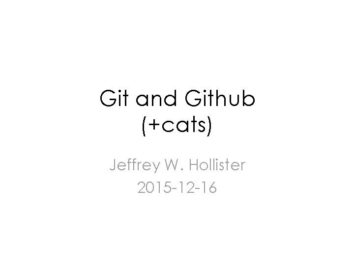

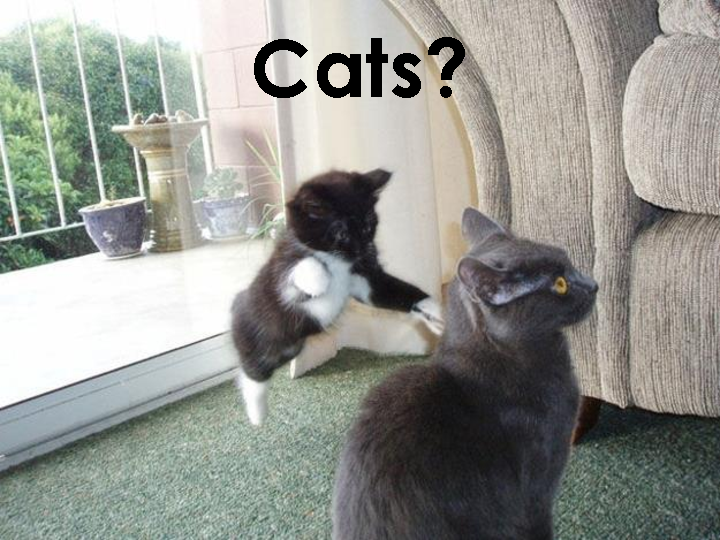

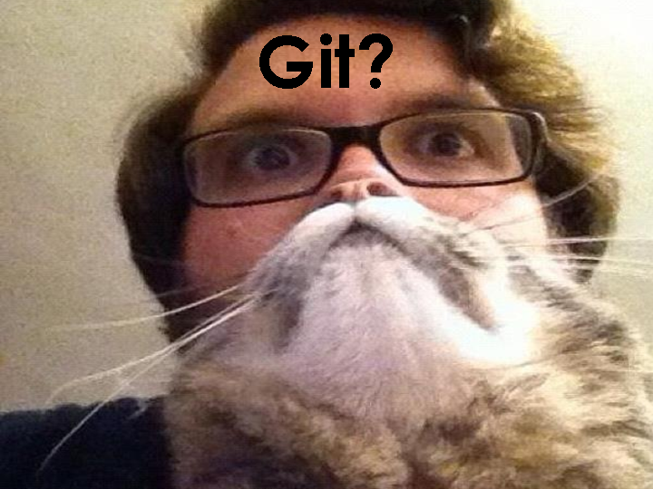

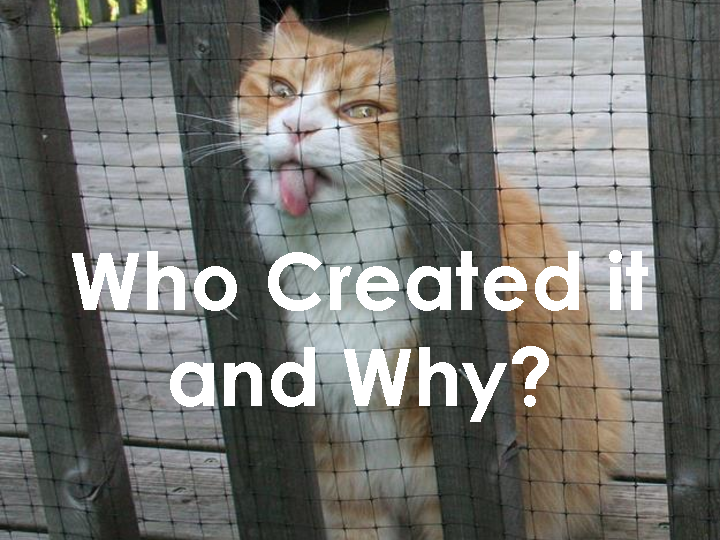

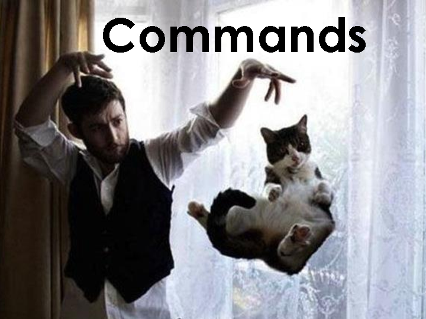

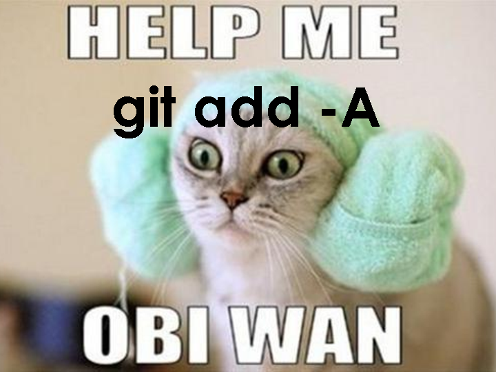

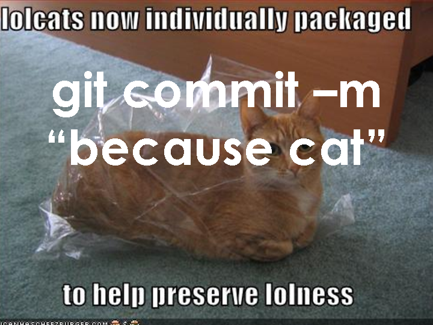

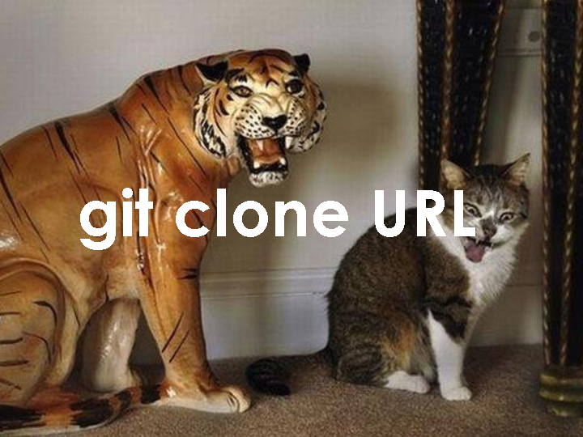

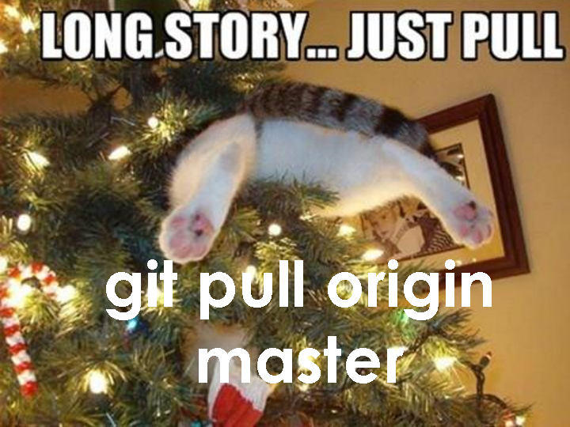

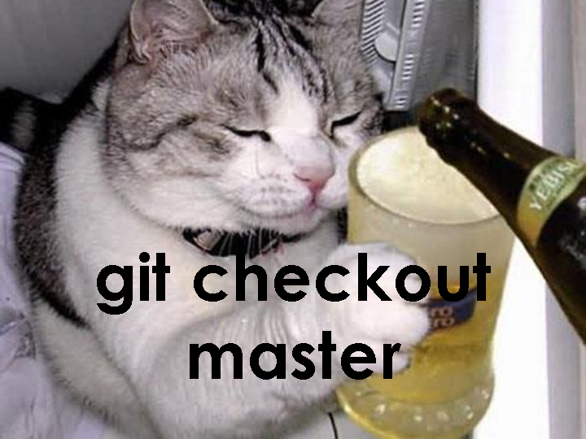

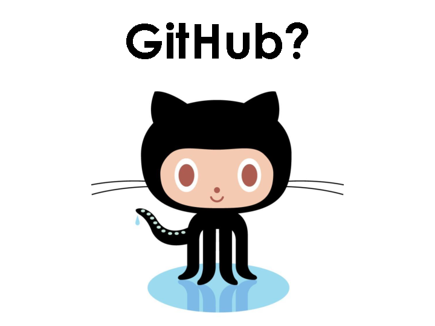

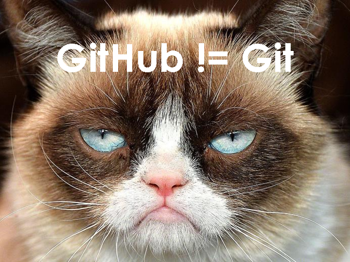

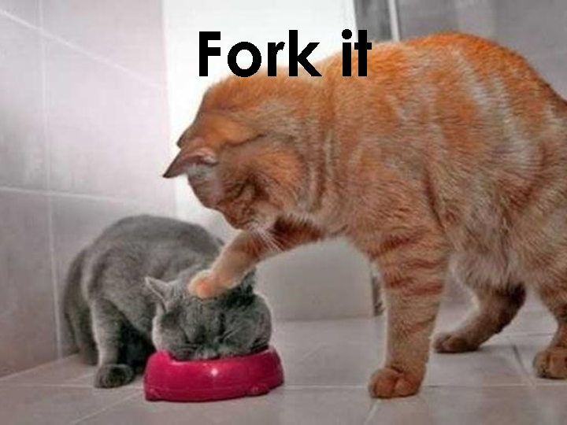

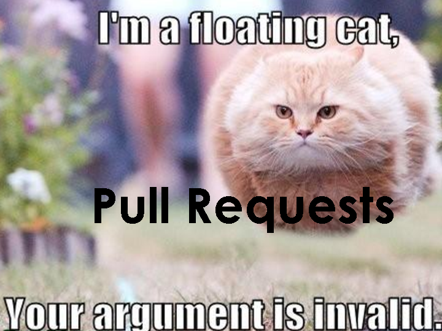

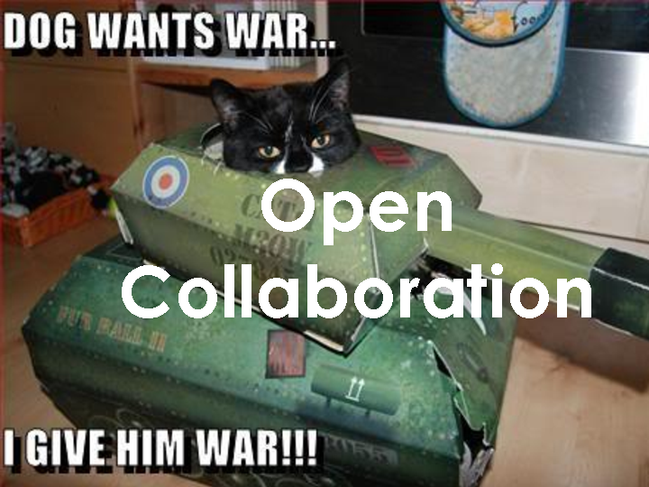

## Version control and R

 - Add and commit received data files, git confirms they
   haven't changed (or tracks changes you choose to make)

 - Add and commit outputs, git lets you know when they
   change, and when they don't

   - e.g. your code's finally working, and you want to
     delete all the junk that wasn't part of the solution.

     As well as letting you undo deletions if you need to, git can
     confirm that the new code produces the same results

    git catches unintended changes

## Git and binary files

 - Just add them, don't worry about it

 - git can't analyze changes between versions of binary
   files, binary files that change are not git's thing

 - For huge binary files, there's the [Git Large File Storage](https://git-lfs.github.com/) extension.

## GitHub, UMN, EPA

 - UMN has a GitHub Enterprise deployment, https://github.umn.edu/

   - Unlimited private repositories
   - Sharing with public harder, can create guest accounts

 - EPA has an Organisation on the public GitHub site, https://github.com/USEPA

   - Can request private repositories, somewhat limiting
   - Easy to share with public

## Resources

 - This presentation http://tbnorth.github.io/git_for_r/
 - [Git intro.](http://swcarpentry.github.io/git-novice/) from
   [Software Carpentry](http://software-carpentry.org/)
 - [Jeff Hollister's intro.](https://github.com/jhollist/github_101), with cats
 - An [interactive cheat sheet](http://ndpsoftware.com/git-cheatsheet.html)
 - The [git](https://git-scm.com/) and [GitHub](https://github.com/)
   sites
