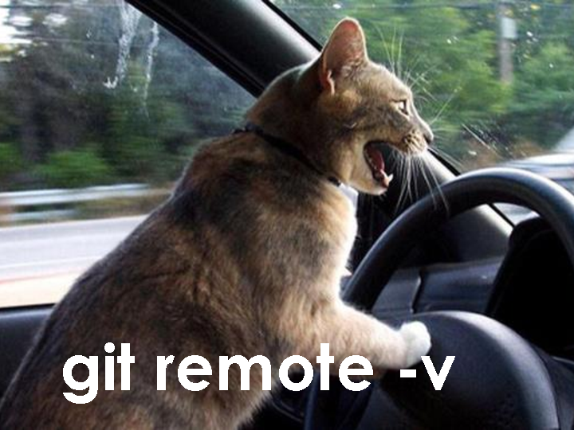

# Version control and R

Terry N. Brown

Brown.TerryN@epa.gov

# Version Control

 - You create `commits` (or snapshots, or versions) of all the
   components of a project at a point in time

    *zero* concern about changing
   code, you can always get back to this point

 - You can revert to any previous commit, or compare the current
   files with previous commits to see differences

    get back to a working version, or see what
   changed

# Version Control cont.

 - Version control tools can (usually) automatically merge
   changes to the same file by different authors

    Gives you “track changes” collaboration
   for everything (because everything should be a text file ;-)

 - Version control tools, and git in particular, provide a way of
   identifying the version of code which produced a particular output
   
    Reproducible results

# Version control with `git`

 - `git` got all the ~~delegates~~ users, there's nothing else to use
 
 - People use git and GitHub for all sorts of things, for example 
   as a way of installing R packages

 - GitHub has lots of added benefits, issue tracking, task management,
   free hosting (for public work).

    learning git has wide spread uses

# Manual version control

 - Can't you just use file names / folders to do this?

 - E.g. folders called `20160502`, `20160504`, or files called
   `crosscor.working.R` etc.

 - You *could*, but will you snapshot all the files you mean to?
 
 - Including current outputs?

 - Will it be so easy you retain the “ zero concern about changing
   code” bonus?

# git, GitHub,  GitHub Desktop

 - `git` is a command line program for version control, originally
   developed by Linus Torvalds.  There are others (bazaar (bzr), 
   subversion (svn), cvs, rcs, etc.)

 - `GitHub` is a company that hosts git repositories online with
   value added features (issue tracking, web hosting, enhanced
   collaboration)

 - `GitHub Desktop` is a desktop application (i.e. user interface)
   for git

# Git terms, nouns

 - `repository` - the git files that record all previous versions
   of a project.  Usually a special folder called `.git`.

 - `commit` - a particular snapshot of a project at a specific time,
   exists in a repository

 - `index` - a staging area where the changes to be included in a
   commit are collected

 - `working tree` - your files and folders

 - `branch` - a distinct series of commits used to isolate development
   of a particular feature from the main code, or perhaps to isolate
   incoming non-QA'ed data from the main, QA'ed set of data

 - `fork` - a copy of a repository on GitHub, for “unilateral” collaboration

# Git terms, verbs

 - `init` - creat a new empty repository

 - `clone` - making a copy of repository, from local file system
   or remote location via web

 - `push` - send changes (commits) from this repository to another

 - `pull` - bring changes (commits) another repository to this one

 - `checkout` - change some or all of the working tree to match
   a particular commit or branch

 - commit, branch, fork - the process of creating one of these things

# Cats

# Resources

 - This presentation FIXME
 - [Git intro](http://swcarpentry.github.io/git-novice/) from
   [SoftWare Carpentry](http://software-carpentry.org/)
 - [Jeff Hollister's intro.](https://github.com/jhollist/github_101), with cats
